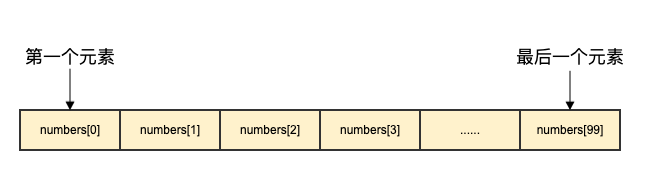
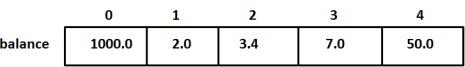

# Go语言数组

##### 上节我们讲述了Go语言作用域，那么接下来我们来讲解Go语言数组

### 一、学习目标

Go语言提供了数组类型的数据结构
数组是具有唯一类型的一组以编写号且长度固定的数据项序列，这种类型可以是任意的原始类型例如整型、字符串、或者自定义类型。相对于去声明`number0`,`number1`,……`number99`的变量，使用数组形式`numbers[0]`,`numbers[1]`……`numbers[99]`更加方便且容易拓展，数组元素可以通过索引(位置)来读取，索引从0开始，第一个元素索引为0，第二个元素索引为1,以此类推;


### 二、声明数组

Go语言数组声明需要指定元素类型及元素个数，语法格式如下:

```go
var varible_name [SIZE] varible_type
```

以上为数组定义方式。例如定义数组balance长度为10类型float 32;

```go
var blance [10] float32
```

### 三、初始化数组

下面演示了数组初始化:

```go
var balance = [5] float32{1000.0,2.0,3.4,7.0,50.0}
```

初始化数组中`{}`元素不能大于 `[]`里面的数;
如果忽略[]中的数不设置数组大小，Go语言会根据元素个数来设置数组大小:

```go
var balance = [...]float32{1000.0,2.0,3.4,7.0,50.0}
```

该实例与上面的实例是一样的，虽然没有设置数组大小

```go
blance[4] = 50.0
```

以上实例读取了5个元素，元素数组可以通过索引(位置)来读取(或者修改),索引从0开始第一个元素索引为0第二个索引为1以此类推:



##### 访问元素数组


元素数组可以通过索引(位置)来读取格式为数组名后加`中括号` 中括号为索引的值，例如:

```go
var salary float32 = balance[9]
```

以上实例读取了数组balance第10个元素的值;
以下演示了数组完整操作(声明，赋值，访问)的实例:
[案例链接](https://github.com/Yan-Yan0129/Go-example/blob/master/%E7%AC%AC02%E7%AB%A0%EF%BC%9AGo%E8%AF%AD%E8%A8%80%E5%9F%BA%E7%A1%80/%E7%AC%AC08%E8%8A%82%EF%BC%9AGo%E8%AF%AD%E8%A8%80%E4%BD%9C%E7%94%A8%E5%9F%9F/demo04.md)
```go
package main

import "fmt"

func main() {
   var n [10]int /* n 是一个长度为 10 的数组 */
   var i,j int

   /* 为数组 n 初始化元素 */        
   for i = 0; i < 10; i++ {
      n[i] = i + 100 /* 设置元素为 i + 100 */
   }

   /* 输出每个数组元素的值 */
   for j = 0; j < 10; j++ {
      fmt.Printf("Element[%d] = %d\n", j, n[j] )
   }
}
```

以上代码执行结果为:

```go
Element[0] = 100
Element[1] = 101
Element[2] = 102
Element[3] = 103
Element[4] = 104
Element[5] = 105
Element[6] = 106
Element[7] = 107
Element[8] = 108
Element[9] = 109
```

### 四、多维数组

Go语言支持多维数组，以下常用的多维数组声明方式:

```go
var varbiable_name [SIZE1] [SIZE2]……[SIZEN] varible_type
```

一下实例声明了三维数组的整型数组:

```go
var threedim [5][10][4]int
```

### 五、初始化二维数组

多维数组可以通过大括号来初始值。以下实例为一个3行4列的二维实数组:

```go
a = [3][4]int{
    {0,1,2,3},//第一行索引值为0
    {4,5,6,7},//第二行索引值为1
    {8,9,10,11}//第三行索引值为2
}
```

注意：以上代码中倒数第二行的 } 必须要有逗号，因为最后一行的 } 不能单独一行;

### 六、访问二维数组

二维数组通过指定坐标来访问，如数组的行索引与列索引，例如:
[案例链接](https://github.com/Yan-Yan0129/Go-example/blob/master/%E7%AC%AC02%E7%AB%A0%EF%BC%9AGo%E8%AF%AD%E8%A8%80%E5%9F%BA%E7%A1%80/%E7%AC%AC08%E8%8A%82%EF%BC%9AGo%E8%AF%AD%E8%A8%80%E4%BD%9C%E7%94%A8%E5%9F%9F/demo04.md)
```go
val :=  a[2][3]
或
var value int = a[2][3]
```

以上实例访问了二维数组val第三行第四元素
二维数组可以使用循环嵌套来输出元素:

```go
package main

import "fmt"

func main() {
   /* 数组 - 5 行 2 列*/
   var a = [5][2]int{ {0,0}, {1,2}, {2,4}, {3,6},{4,8}}
   var i, j int

   /* 输出数组元素 */
   for  i = 0; i < 5; i++ {
      for j = 0; j < 2; j++ {
         fmt.Printf("a[%d][%d] = %d\n", i,j, a[i][j] )
      }
   }
}
```

以上实例输出结果为:

```go
a[0][0] = 0
a[0][1] = 0
a[1][0] = 1
a[1][1] = 2
a[2][0] = 2
a[2][1] = 4
a[3][0] = 3
a[3][1] = 6
a[4][0] = 4
a[4][1] = 8 
```

### 七、Go语言向函数传递数组

如果你想向函数传递参数，你需要在定义函数时，声明形参为数组，我们将通过以下两种方式来声明:

##### 方式一:

形参设定数组大小:

```go
void myFunction(param[10]int)
{
    .
    .
    .
}
```

##### 方式二:

形参未设定数组大小:

```go
void myFunction(param []int)
{
    .
    .
    .
}
```

好介绍完两种方式后，我们来看下以下实例，实例中函数接收整型组参数，另一个参数指定了函数元素的个数，并返回平均值:

```go
func getAverage(arr []int, size int) float32
{
   var i int
   var avg, sum float32  

   for i = 0; i < size; ++i {
      sum += arr[i]
   }

   avg = sum / size

   return avg;
}
```

接下来我们来调用这个函数:
[案例链接](https://github.com/Yan-Yan0129/Go-example/blob/master/%E7%AC%AC02%E7%AB%A0%EF%BC%9AGo%E8%AF%AD%E8%A8%80%E5%9F%BA%E7%A1%80/%E7%AC%AC09%E8%8A%82%EF%BC%9AGo%E8%AF%AD%E8%A8%80%E6%95%B0%E7%BB%84/demo03.md)
```go
package main

import "fmt"

func main() {
   /* 数组长度为 5 */
   var  balance = [5]int {1000, 2, 3, 17, 50}
   var avg float32

   /* 数组作为参数传递给函数 */
   avg = getAverage( balance, 5 ) ;

   /* 输出返回的平均值 */
   fmt.Printf( "平均值为: %f ", avg );
}
func getAverage(arr [5]int, size int) float32 {
   var i,sum int
   var avg float32  

   for i = 0; i < size;i++ {
      sum += arr[i]
   }

   avg = float32(sum) / float32(size)

   return avg;
}
```

以上实例输出结果为:

```go
平均值:214.399994
```

### 八、总结

本节我们学习了Go语言数组都有什么呢？声明数组 初始化数组 多维数组 初始化二维数组 访问二维数组 最后就是Go语言向函数传递数组；

### 九、作业

1. 练习本节所有案例;

2. 创建一个求数组[1, 3, 5, 7, 8]所有元素的和;

3. 找出数组中和为指定值的两个元素的下标，比如从数组[1, 3, 5, 7, 8]中找出和为8的两个元素的下标分别为(0,3)和(1,2)。
12 条评论;

4. 牢记各个数组类型的书写格式;
