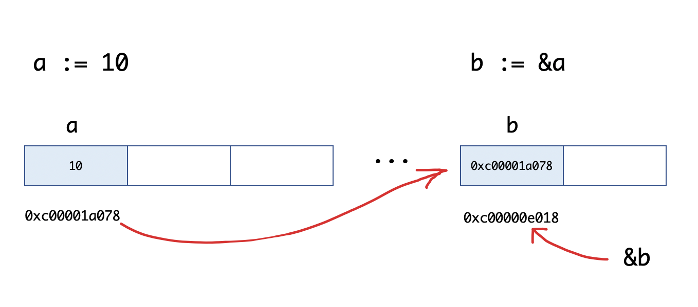

# 第01节:Go语言指针

##### 经过上一张的讲解相信大家学到了很多Go语言的中常用的语法，那么接下来我们来学习Go语言指针;首先什么是指针呢？指针是如何使用的呢？请看本章节的讲解:

### 一、学习目标

Go语言中指针是很容易学的！但是要知道Go语言中的指针需要知三个概念:`指针地址`、`指针类型`和`指针取值`就可以了;

### 二、Go语言中的指针

任何数据载入内存后，在内存中都有他们的地址，这就是指针，而为了保存一个数据在内中的地址，我们就需要指针变量。
Go语言中的指针不能进行偏移和运算，因此Go语言中的指针操作非常简单，我们只需要记住两个符号: `&`(取地址)和`*`(根据地址取值)

##### 什么是指针

一个指针变量指向了一个值的内存地址
类似于变量和常量，在使用指针前你需要声明指针，指针声明格式如下:

```go
var var_name * var-type
```

`var-type`为指针类型 `var_name`为指针变量名 `*`号用于指定变量是作为一个指针，一下是有效的指针声明:

```go
var ip * int      //指针整型
var fp * float32  //指向浮点型
```

上面按例讲述的是 `int` 和 `float32` 的指针

##### 怎么使用指针

指针使用流程为:

* 定义指针变量
* 为指针变量赋值
* 访问指针变量中指向地址的值

在指针类型上面加上 `*` 号(前缀)来获取指针所指向的内容

本例中这是一个指向 int 和 float32 的指针:
[案例链接](https://github.com/Yan-Yan0129/Go-example/blob/master/%E7%AC%AC03%E8%8A%82%EF%BC%9AGo%E8%AF%AD%E8%A8%80%E6%8C%87%E9%92%88/%E7%AC%AC01%E8%8A%82%EF%BC%9AGo%E8%AF%AD%E8%A8%80%E6%8C%87%E9%92%88/demo01.md)
```go
package main

import "fmt"

func main() {
   var a int= 20   /* 声明实际变量 */
   var ip *int        /* 声明指针变量 */

   ip = &a  /* 指针变量的存储地址 */

   fmt.Printf("a 变量的地址是: %x\n", &a  )

   /* 指针变量的存储地址 */
   fmt.Printf("ip 变量储存的指针地址: %x\n", ip )

   /* 使用指针访问值 */
   fmt.Printf("*ip 变量的值: %d\n", *ip )
}
```

以上代码执行结果为:

```go
a 变量的地址是: 20818a220
ip 变量储存的指针地址: 20818a220
*ip 变量的值: 20
```

##### Go空指针

* 当指针被定义后没有分配到任何变量时它的值为`nil`
* `nil`也被称为空指针
* `nil`在概念上和其他语言上的null,None,nil,NULL一样,都指带零值或空值
* 一个指针通常缩写成 `ptr`

看下面这个实例:
[案例链接](https://github.com/Yan-Yan0129/Go-example/blob/master/%E7%AC%AC03%E8%8A%82%EF%BC%9AGo%E8%AF%AD%E8%A8%80%E6%8C%87%E9%92%88/%E7%AC%AC01%E8%8A%82%EF%BC%9AGo%E8%AF%AD%E8%A8%80%E6%8C%87%E9%92%88/demo02.md)
```go
package main

import "fmt"

func main() {
   var  ptr *int

   fmt.Printf("ptr 的值为 : %x\n", ptr  )
}
```

以上实例输出结果为:

```go
ptr的值为:0
```

控制判断:

```go
if(ptr != nil)   //ptr不是空指针
if (ptr == nil)  //ptr是空指针
```

### 三、指针地址和指针类型

每个变量在运行时都拥有一个地址，这个地址代表变量内存中的位置。Go语言中使用`&`字符放在变量前面对变量进行“取地址”操作。Go语言中值类型(int,bool,string,float,array,struct)都有对应的指针类型;如 `*int` `*int64`,`*string`等！

取变量指针类型如下:

```go
ptr := &v
```

其中:

* v:代表取地址的变量，类型为`T`;

* ptr:用于接收地址的变量，ptr类型就为`T`，称为`T`指针类型;

举个例子:

```go
func main() {
	a := 10
	b := &a
	fmt.Printf("a:%d ptr:%p\n", a, &a) // a:10 ptr:0xc00001a078
	fmt.Printf("b:%p type:%T\n", b, b) // b:0xc00001a078 type:*int
	fmt.Println(&b)                    // 0xc00000e018
}
```

我们来看一下 `b := &a`的展示图:



### 四、指针取值

在对普通变量`&`操作符进取地址后获得这个变量的指针，然后可以对指针使用*操作，也就是取指针，代码如下:
[案例链接](https://github.com/Yan-Yan0129/Go-example/blob/master/%E7%AC%AC03%E8%8A%82%EF%BC%9AGo%E8%AF%AD%E8%A8%80%E6%8C%87%E9%92%88/%E7%AC%AC01%E8%8A%82%EF%BC%9AGo%E8%AF%AD%E8%A8%80%E6%8C%87%E9%92%88/demo03.md)
```go
func main() {
	//指针取值
	a := 10
	b := &a // 取变量a的地址，将指针保存到b中
	fmt.Printf("type of b:%T\n", b)
	c := *b // 指针取值（根据指针去内存取值）
	fmt.Printf("type of c:%T\n", c)
	fmt.Printf("value of c:%v\n", c)
}
```

代码执行结果如下:

```go
type of b:*int
type of c:int
value of c:10
```

取地址操作符`&`和取值操作符`*`是一对互补操作符，`&`取出地址，`*`根据地址取出地址指向的值;

变量、指针地址、指针变量、取地址、取值的相互关系和特征如下:

* 对变量进行取地址值(&)操作，可以获得这个指针的变量;
* 指针变量的值是指针地址;
* 对指针变量进行取值(*)操作，可以获得指针变量指向的原变量值;

##### 值传递示例

```go
func modify1(x int){
    x = 100
}
func modify1( x *int){
    *x = 100
}
func main(){
    a := 10
    modifyi1(a)
    fmt.println(a)//10
    modifyi1(&a)
    fmt.println(a)//100
}
```

### 五 总结

本节我们讲述了什么是指针，如何使用指针，指针地址和指针类型，指针的取值,大家学到什么了呢？下节讲述Go语言指针:new和make的区别;

### 六、作业

1. 练习本节所有案例;

2. 随意创建一个指针，首先定义一个指针，给指针赋值， 最后访问指针的指针指针地址;

3. 牢记指针使用语法;
 