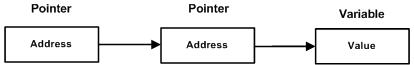

# 第03节:Go语言指针拓展

##### 前两节我们讲述了指针的用法接下来我们来拓展一下指针的更多内容

### 一、Go语言指针数组

在开始学习指针数组之前我们先来看一下例子,定义了长度为3的整型数组:
[案例链接](https://github.com/Yan-Yan0129/Go-example/blob/master/%E7%AC%AC03%E7%AB%A0%EF%BC%9AGo%E8%AF%AD%E8%A8%80%E6%8C%87%E9%92%88/%E7%AC%AC03%E8%8A%82%EF%BC%9AGo%E8%AF%AD%E8%A8%80%E6%8C%87%E9%92%88%E6%8B%93%E5%B1%95/demo01.md)

```go
package main

import "fmt"

const MAX int = 3

func main() {

   a := []int{10,100,200}
   var i int

   for i = 0; i < MAX; i++ {
      fmt.Printf("a[%d] = %d\n", i, a[i] )
   }
}
```

以上实例执行结果为:

```go
a[0] = 10
a[1] = 100
a[2] = 200
```

还有一种情况，我们可以保存数组，这样我们就会需要使用指针;

以下声明了整型指针数组:

```go
var ptr [MAX]*int;
```

ptr为整型指针数组。因此每个元素都指向了一个值，下面这个实例三个整数将存储在指针数组中:
[案例链接](https://github.com/Yan-Yan0129/Go-example/blob/master/%E7%AC%AC03%E7%AB%A0%EF%BC%9AGo%E8%AF%AD%E8%A8%80%E6%8C%87%E9%92%88/%E7%AC%AC03%E8%8A%82%EF%BC%9AGo%E8%AF%AD%E8%A8%80%E6%8C%87%E9%92%88%E6%8B%93%E5%B1%95/demo02.md)

```go
package main

import "fmt"

const MAX int = 3

func main() {
   a := []int{10,100,200}
   var i int
   var ptr [MAX]*int;

   for  i = 0; i < MAX; i++ {
      ptr[i] = &a[i] /* 整数地址赋值给指针数组 */
   }

   for  i = 0; i < MAX; i++ {
      fmt.Printf("a[%d] = %d\n", i,*ptr[i] )
   }
}
```

以上代码执行结果为:

```go
a[0] = 10
a[1] = 100
a[2] = 200
```

### 二、GO语言指向指针的指针

如果一个指针变量存的又是另外一个指针变量地址，则称这个指针变量为指向指针的指针变量;
当定义一个指向指针的指针变量时,第一个指针存放第二个指针的地址，第二个指针存放变量的地址:



指向指针的指针变量格式如下:

```go
var ptr **int
```

以上是指向指针的指针变量类型,访问指向指针的指针变量需要两个`*`号,实例如下:
[案例链接](https://github.com/Yan-Yan0129/Go-example/blob/master/%E7%AC%AC03%E7%AB%A0%EF%BC%9AGo%E8%AF%AD%E8%A8%80%E6%8C%87%E9%92%88/%E7%AC%AC03%E8%8A%82%EF%BC%9AGo%E8%AF%AD%E8%A8%80%E6%8C%87%E9%92%88%E6%8B%93%E5%B1%95/demo03.md)

```go
package main

import "fmt"

func main() {

   var a int
   var ptr *int
   var pptr **int

   a = 3000

   /* 指针 ptr 地址 */
   ptr = &a

   /* 指向指针 ptr 地址 */
   pptr = &ptr

   /* 获取 pptr 的值 */
   fmt.Printf("变量 a = %d\n", a )
   fmt.Printf("指针变量 *ptr = %d\n", *ptr )
   fmt.Printf("指向指针的指针变量 **pptr = %d\n", **pptr)
}
```

以上代码执行结果为:

```go
变量 a = 3000
指针变量 *ptr = 3000
指向指针的指针变量 **pptr = 3000
```

### 三、Go语言指针作为函数参数

Go语言允许向函数传递指针，只需要在函数定义的参数上设置为指针定义类型即可。
以下实例演示如何向函数传递指针，并在函数调用后修改函数内的值:
[案例链接](https://github.com/Yan-Yan0129/Go-example/blob/master/%E7%AC%AC03%E7%AB%A0%EF%BC%9AGo%E8%AF%AD%E8%A8%80%E6%8C%87%E9%92%88/%E7%AC%AC03%E8%8A%82%EF%BC%9AGo%E8%AF%AD%E8%A8%80%E6%8C%87%E9%92%88%E6%8B%93%E5%B1%95/demo04.md)

```go
package main

import "fmt"

func main() {
   /* 定义局部变量 */
   var a int = 100
   var b int= 200

   fmt.Printf("交换前 a 的值 : %d\n", a )
   fmt.Printf("交换前 b 的值 : %d\n", b )

   /* 调用函数用于交换值
   * &a 指向 a 变量的地址
   * &b 指向 b 变量的地址
   */
   swap(&a, &b);

   fmt.Printf("交换后 a 的值 : %d\n", a )
   fmt.Printf("交换后 b 的值 : %d\n", b )
}

func swap(x *int, y *int) {
   var temp int
   temp = *x    /* 保存 x 地址的值 */
   *x = *y      /* 将 y 赋值给 x */
   *y = temp    /* 将 temp 赋值给 y */
}
```

以上实例代码执行结果为:

```go
交换前 a 的值 : 100
交换前 b 的值 : 200
交换后 a 的值 : 200
交换后 b 的值 : 100
```

### 四、总结

本节我们讲述Go语言指针数组、Go语言指向指针的指针、Go语言指针作为函数参数，类型不一样使用后输出结果也不同;