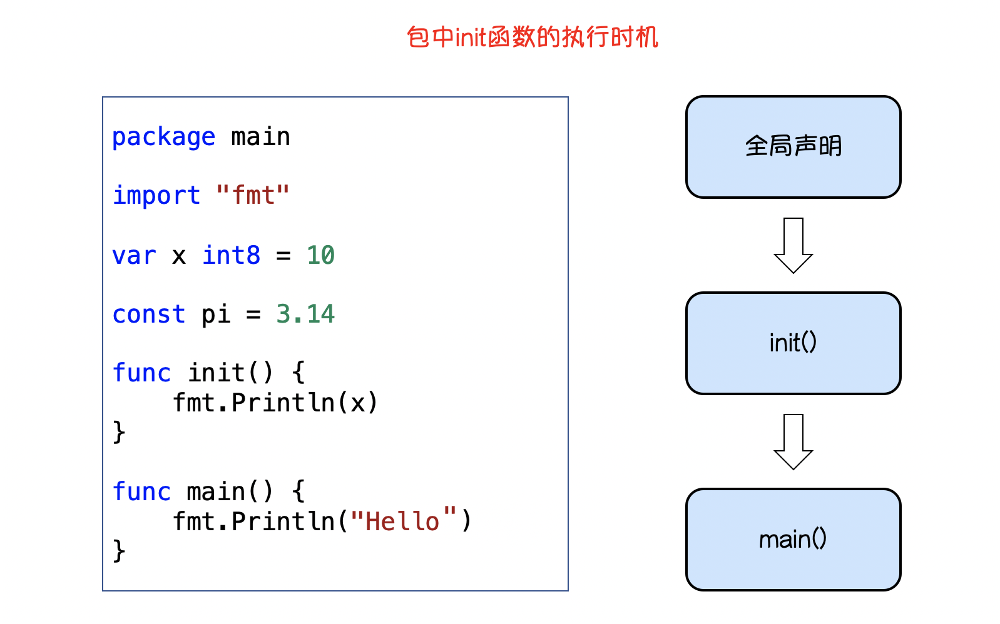
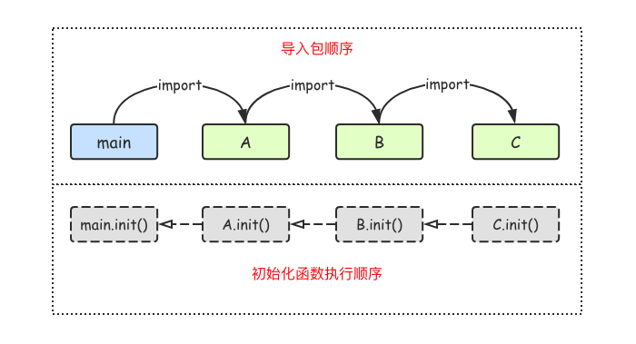

# 第01节:Go语言的包

##### 本节我们学习Go语言包(package)，如何使用包，包的导入：

### 一、包介绍

`包(package)` 是多个Go源码的集合，是一种高级的复用方案，Go语言为我们提供了很多内置包，如 `fmt` 、`os` 、 `io`等;

### 二、定义包

我们好可以根据自己需要创建自己的包，一个包可以简单理解为存放 `.go` 文件的文件夹，该文件夹下面所有go文件都要在代码的第一行添加如下代码，声明文件归属的包:

```go
package 包名
```

**注意事项** 

* 一个文件夹下面只能有一个包，同样一个包的文件不能在多个文件夹下。
* 包名可以不和文件夹名一样，但是包不能包含 - 字符
* 包名main的包应程序入口包，编译不包含main包的源码时不会得到可执行文件

### 三、可见性

如果想在一个包中引用另一个包里的标识符(如:变量、常量、函数、类型等)时该标识符必须是对外可见的(public)在Go语言中只需要将标识符的首字母大写就可以让标识符对外可见了。
举个例子，我们来定义一个`pke2`的包，代码如下:

```go
package pkg2

import "fmt"

// 包变量可见性

var a = 100 // 首字母小写，外部包不可见，只能在当前包内使用

// 首字母大写外部包可见，可在其他包中使用
const Mode = 1

type person struct { // 首字母小写，外部包不可见，只能在当前包内使用
	name string
}

// 首字母大写，外部包可见，可在其他包中使用
func Add(x, y int) int {
	return x + y
}

func age() { // 首字母小写，外部包不可见，只能在当前包内使用
	var Age = 18 // 函数局部变量，外部包不可见，只能在当前函数内使用
	fmt.Println(Age)
}
```

结构体中的字段名和接口中的方法名如果首字母都是大写，外部包可以访问这些字段和方法，例如:

```go
type Student struct {
    Name string     //可在外包访问的方法
    class string    //仅限包内访问的字段
}

type Payer interface {
    init()   //仅限包内访问的方法
    Pay()    //可在包外访问的方法
}
```

### 四、包的导入

要在代码引用其他包的内容，需要使用 `import` 关键字导入使用包，具体语法如下:

```go
import "包的路径"
```

**注意事项**  

* import导入语句常放在文件开头包声明语句下面
* 导入的包名需要使用双引号包裹起来
* 包名是从 `$GOPATH/src/` 后开始计算的，使用/来进行路径分离
* Go语言中禁止循环导入包

##### 单行导入

单行导入的格式如下:

```go
import "包1"
import "包2"
```

##### 多行导入

多行导入文件格式如下:

```go
import {
    "包1"
    "包2"
}
```

##### 自定义包名

在导入包名的时候，我们还可以为导入的包设置别名，具体语法格式如下:

```go
import 别名 "包的路径"
```

单行导入方式定义别名:

```go
import "fmt"
import m "github.com/Q1mi/studygo/pkg_test"

func main() {
	fmt.Println(m.Add(100, 200))
	fmt.Println(m.Mode)
}
```

多行导入方式定义别名:

```go
import (
    "fmt"
    m ""github.com/Q1mi/studygo/pkg_test"
)
func main() {
	fmt.Println(m.Add(100, 200))
	fmt.Println(m.Mode)
}
```

##### 匿名导入包

如果只是希望导入包而不适用包内部数据时，可以使用匿名包，具体格式如下:

```go
import _ "包的路径"
```

匿名导入的包与其他导入包一样都会被编译可执行文件中;

### 五、init()初始化函数

##### init()函数介绍

在Go语言程序执行导入包语句会自动触发包内部 `init()` 函数的调用。需要注意的是:`init()` 函数没有参数也没有返回值。`init()` 函数在程序运行时会自动调用执行，不能再代码中调用它;
包初始化执行顺序如下图所示:




##### init()函数执行顺序

Go语言包会从 `main` 包开始检查其导入所有包，每个包中又有可能导入了其他包，Go编译器由此构建出一个树状的包引用关系，在根据引用顺序来决定编译顺序，依次编译这些包的代码;
在运行时，被最后导入的包会最先初始化bong调用其`init()` 函数，如下图所示:


### 六、总结

本节我们讲述了Go语言包的使用，如何定义包，导入包，包括单行导入、多行导入、匿名导入、还有自定义导入、最后介绍了init()初始化函数：