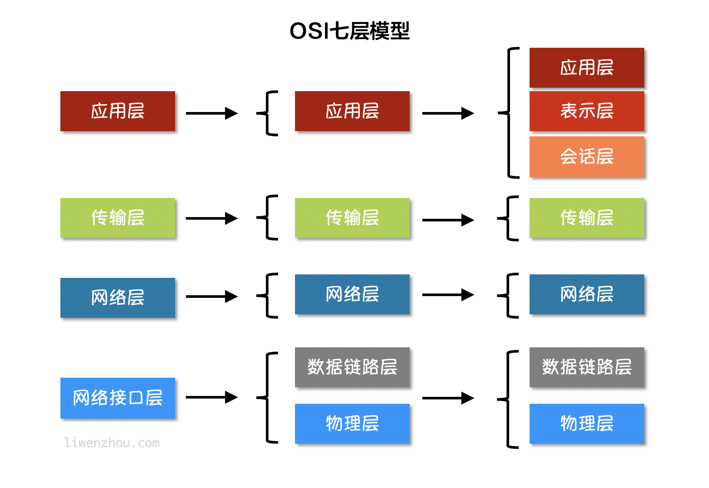
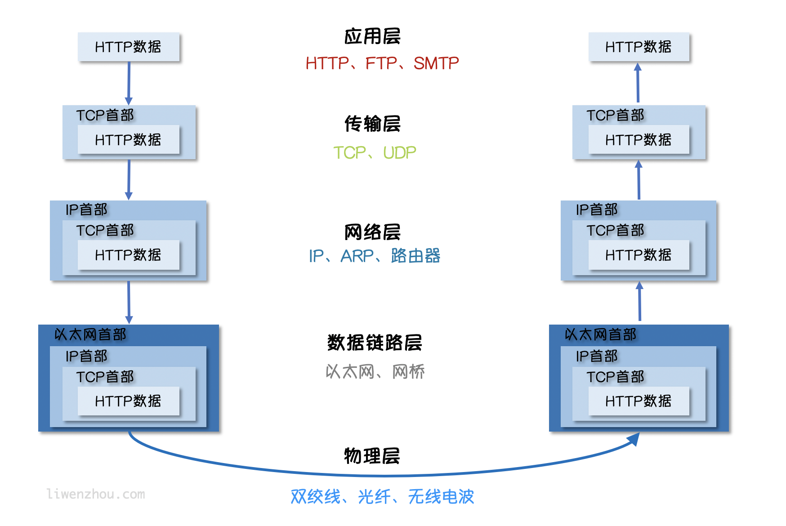
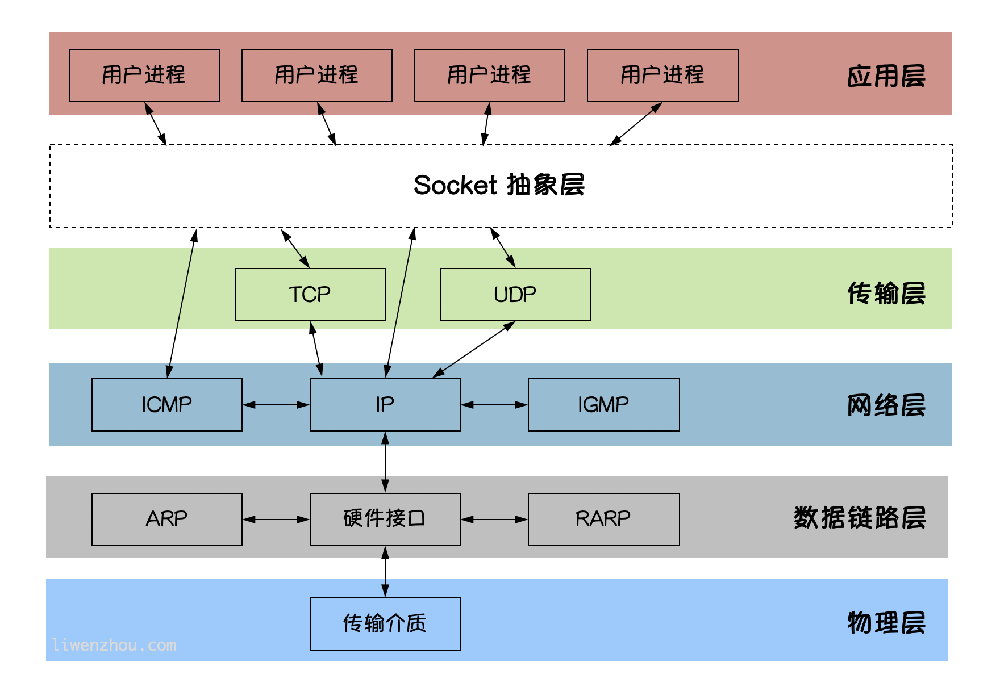

# 第01节：Go语言基础之网络编程

##### 现在我们几乎都使用互联网，我们前面学习了如何编写Go语言程序，但是如何才能让我们的程序通过网络互相通信呢？本节我们就开始学习Go语言中的网络编程，关于网络其实是一个庞大的领域，本节只是演示了如何使用net包进行TCP和UDP通信。

### 一、互联网协议介绍

互联网的核心是一系列协议，总称为"互联网协议"(Internet Portocol Suite)，正是这一些协议决定了电脑如姐连接和组网，如果我们理解了这些协议，就理解了互联网的原理，由于这些协议太过于庞大与复杂，只能介绍一些我们日常开发中接触的一些协议。

### 二、互联网分层模型

互联网的逻辑实现被分为好几层，每一层都有自己的功能，就像建筑一样，每一层都靠下一层支持，用户只是接触的最上面那一层，根本不会感觉到下面几层，要理解互联网就需要自上而下理解每一层实现的功能;



如上图所示，互联网按照不同的模型划分会有不用的分层，但是无论按照什么模型去划分，越往上的模型越靠近用户，越网下面的层越靠近硬件，在软件开发中我们使用最多的是上图将互联网划分为五个分层模型;
接下来我们一层一层的由下自上的介绍每一层;

##### 物理层

我们电脑想要与外界互联网通信，需要把电脑连接网络，我们可以改成双绞线、光纤、无线电波等方式,这就叫"实物物理层"它就是把电脑连接起来的物理手段，他主要规定了网络里面的一些电气特性，作用是负责传送0和1的电信号。

##### 数据链路层

单纯的0和1没有没有任何意义，所以我们使用者会为其赋予一些特定的含义，规定解读电信号的方式，例如：多少个电信号算一组？每个信号位有何意义？这就是"数据连接层"的功能，它在"物理层"的上方，确定了物理层传输的0和1的分组方式及代表的意义，早期的时候，每家公司都有自己家的电信号分组方式，逐渐的一种叫"以太网(Ethernet)"的协议，占据了主导地位。
以太网规定，一组电信号构成一个数据包，叫做"帧(Frame)"，每一帧分成两个部分，标头(Head)和数据(Data)，其中"标头"包含的具体内容，"标头"的长度，固定为18字节，"数据"的长度，最短为46字节，最长为1500字节，因此整个"帧"最短为64字节，最长为1518字节。如果数据很长的话就要分为多个帧进行发送。
那么发送者和接受者是如何标识呢？以太网规定，连入网络所有设备都必须是具有"网卡"接口，数据包必须是一块网卡，传送到另一块网卡，网卡的地址，就是数据包的发送地址和接收地址，这叫做MAC地址。每块网卡出厂的时候，都有一个世界上独一无二的MAC地址，长度是48个二进制，通常用12个十六进制的标识符是厂商的编号，后6个是厂商的网卡流水号，有了MAC地址，就可以定位网卡和数据包的路径了。
我们会通过APP协议来获取接收方的MAC地址，有了MAC地址之后，如何把数据准确的发送给接受方呢？其实这里以太网采用了一种很原始的方法，他不是把数据包准确的送到接收方，而是像本网络内所有计算机都发送，让每个包都读取这个包的"标头"，找到这个接受方的MAC地址相比较，如果两者相同，就接受这个包，做进一步处理，否则就丢了这个包，这种方式叫"广播(broadcasting)"。

##### 网络层

按照以太网协议的规则我们可以靠MAC地址来向外发送数据，理论上依靠MAC地址，你电脑网卡就可以找到身在世界上另一个角落的某台电脑的网卡了，但是这种做法最大的缺陷就是以太网采用广播方式发送数据包，所有成员人手一"包"不仅效率低，而且发送的数据只能局限在发送者所在的子网络，也就是说如果两台计算机不在同一个网络，广播是传不过去的，这种设计是合理必要的，因为如果互联网上收发的数据包，那是不现实的。
因此就需要找到一种方法区分那些MAC地址属于同一个子网络，那些不是，如果同一个子网络，就采用广播的方式，否则就采用"路由"方式发送，这就导致了"网络层"的诞生，它的作用是引进一套新地址，使得我们区分不同计算机时是否属于同一个子网络，这套地址就叫做"网络地址"简称"网址"。
"网络层"出现后，每台计算机有了两种地址，一种是MAC地址一种是网络地址，两种地址之间没有任何联系，MAC地址是绑定在网卡上的，网络地址则是网络管理员分配的，网络地址帮助我们确定计算机所在的子网络，MAC地址则将数据包送到该子网络中的目标网卡，因此，从此逻辑上可以推断，必先是先处理网络地址，然后在处理MAC地址。
规定网络地址的协议，叫做IP协议，它所定义的地址，就被称为IP地址，目前广泛采用的是IP协议第四版，简称IPv4,IPv4这个版本规定，网络地址由32个二进制位组成，我们通常习惯用分成四段的十进制数表示IP地址，从0.0.0.0一直到255.255.255.255。
根据IP协议发送的数据，就叫做IP数据包。IP数据包也分为”标头”和”数据”两个部分：”标头”部分主要包括版本、长度、IP地址等信息，”数据”部分则是IP数据包的具体内容。IP数据包的”标头”部分的长度为20到60字节，整个数据包的总长度最大为65535字节。

##### 传输层

有了MAC地址和IP地址，我们已经可以在互联网上任意两台主机上建立通信，但问题是同一台主机上会有很多程序都需要用网络编程来收发数据，比如QQ和浏览器这两个程序都需要链接互联网并收发数据，我们如何区分某个数据包到底是哪个日程序的呢？也就是说我们还需要一个参数，表示这个数据包到底提供哪些程序(进程)使用。这个参数就叫"端口"所以不同的程序就可能获取到自己所需要的数据!
"端口"是0到65535之间的一个整数，正好16个二进制位，0到1023的端口被系统占用，用户只能选择大于1023的端口，有了IP和端口我们就能实现唯一确定互联网上一个程序，进而实现网络间的程序通信。
我们必须在数据包中加入端口信息，这就需要一个新协议，最简单的实现叫UDP协议，它的格式几乎就是在数据前面，加上端口号，UDP数据包，也是由"标头"和"数据"两部分组成:"标头"部分主要定义了发出端口和接收端口，"数据"部分就是具体内容，UDP数据非常简单，"标头"部分一共只有8个字节，总长度不超过65535字节，正好放进一个IP数据包。
UDP协议的优点是比较简单，容易实现，但是缺点可考性较差，一旦数据发出，无法知道对方是否收到，为了解决这一问题，提高网络可靠性，TCP协议就诞生了TCP协议能够保证数据不遗失，它的缺点是过程复杂，实现困难，消耗较多资源，TCP数据包没有限制，理论上可以无限长，但是为了保证网络开发效率，通常TCP数据包的长度不会超过IP的长度，以确保单个ICP数据不必再分割。

##### 应用层

应用程序收到"传输层"数据，接下来就到了对数据进行解包，由于互联网是开放架构，数据来源于五花八门，必须先规定好通信的数据格式，否则接收方根本无法获得真正发送的数据内容，"应用层"的作用就是规定程序使用的数据格式，例如我们TCP协议之常见的Email、HTTP、FTP等协议，这些协议就组成了互联网协议的应用层。
如下图所示，发送方的HTTP数据经过互联网的传输过程中会依次添加各层协议的标头信息，接收方收到数据包之后再依次根据协议解包得到数据。



### 三、socket编程

Socket是BSD UNTX的进程通信机制，通常也被称为"套接字"，用于描述IP地址和端口，是一个通信链的句柄。Socket可以理解为TCP/IP网络上的应用程序，电脑上运行的应用程序。电脑上运行的应用程序通常通过"套接字"向网络发出请求或者应答网络要求。

##### socket图解

`socket`是应用过层与TCP/IP协议族通信中间软件抽象层，在设计模式中，`socket`其实就是一个门面模式，它把复杂的TCP/IP协议族隐藏在`Socket`后面，对用户来说只需要调用Socket规定的相关函数，让`socket`去组织符合指定的协议数据然后通信。



### 四、Go语言实现TPC通信

##### TCP协议

TCP/IP(Transmission Control Protocol/Internet Protocol)即输出控制协议，是一种面向连接(连接向导)的、可靠、基于字节流的传输层(Transport layer)通信协议，因为是面向连接的协议，数据像流水一样传输，会存在黏包问题。

##### TCP服务端

一个TCP服务端可以同时连接多个客户端，例如世界各地用户使用自己电脑上的电脑访问淘宝网，因为Go语言中创建多个goroutine实现并发非常方便高效，所以我们每建立一次链接就创建一个goroutine去处理。
TCp服务端程序的处理流程:
1. 监听端口。
2. 接收客户端请求建立链接。
3. 创建goroutine处理链接。
我们使用Go语言的net包实现的TCP客户端代码如下:

```go
// tcp/server/main.go

// TCP server端

// 处理函数
func process(conn net.Conn) {
	defer conn.Close() // 关闭连接
	for {
		reader := bufio.NewReader(conn)
		var buf [128]byte
		n, err := reader.Read(buf[:]) // 读取数据
		if err != nil {
			fmt.Println("read from client failed, err:", err)
			break
		}
		recvStr := string(buf[:n])
		fmt.Println("收到client端发来的数据：", recvStr)
		conn.Write([]byte(recvStr)) // 发送数据
	}
}

func main() {
	listen, err := net.Listen("tcp", "127.0.0.1:20000")
	if err != nil {
		fmt.Println("listen failed, err:", err)
		return
	}
	for {
		conn, err := listen.Accept() // 建立连接
		if err != nil {
			fmt.Println("accept failed, err:", err)
			continue
		}
		go process(conn) // 启动一个goroutine处理连接
	}
}
```
将上面代码保存后编译成`server`或`server.exe`可执行文件。

### 五、TCP黏包

##### 黏包示例

服务端代码如下:

```go
// socket_stick/server/main.go

func process(conn net.Conn) {
	defer conn.Close()
	reader := bufio.NewReader(conn)
	var buf [1024]byte
	for {
		n, err := reader.Read(buf[:])
		if err == io.EOF {
			break
		}
		if err != nil {
			fmt.Println("read from client failed, err:", err)
			break
		}
		recvStr := string(buf[:n])
		fmt.Println("收到client发来的数据：", recvStr)
	}
}

func main() {

	listen, err := net.Listen("tcp", "127.0.0.1:30000")
	if err != nil {
		fmt.Println("listen failed, err:", err)
		return
	}
	defer listen.Close()
	for {
		conn, err := listen.Accept()
		if err != nil {
			fmt.Println("accept failed, err:", err)
			continue
		}
		go process(conn)
	}
}
```

客户端代码如下:

```go
// socket_stick/client/main.go

func main() {
	conn, err := net.Dial("tcp", "127.0.0.1:30000")
	if err != nil {
		fmt.Println("dial failed, err", err)
		return
	}
	defer conn.Close()
	for i := 0; i < 20; i++ {
		msg := `Hello, Hello. How are you?`
		conn.Write([]byte(msg))
	}
}
```

将上面代码代码保存后，分别编译，先启动服务端在开客户端，可以看到服务端输出结果如下:

```go
收到client发来的数据： Hello, Hello. How are you?Hello, Hello. How are you?Hello, Hello. How are you?Hello, Hello. How are you?Hello, Hello. How are you?
收到client发来的数据： Hello, Hello. How are you?Hello, Hello. How are you?Hello, Hello. How are you?Hello, Hello. How are you?Hello, Hello. How are you?Hello, Hello. How are you?Hello, Hello. How are you?Hello, Hello. How are you?
收到client发来的数据： Hello, Hello. How are you?Hello, Hello. How are you?
收到client发来的数据： Hello, Hello. How are you?Hello, Hello. How are you?Hello, Hello. How are you?
收到client发来的数据： Hello, Hello. How are you?Hello, Hello. How are you?
```

客户端分10次发送数据，在服务端并没有成功的输出10次，而是多了条数据"粘"到了一起。

##### 为什么会出现黏包

主要原因就是tcp数据模式是流模式，在保持长连接的时候进行多次的收和发。
"黏包"可能发生在发送客户端也可以发生在接收端:
1. 由Nagle算法造成的发送客户的粘包：Nagle算法是一种改善网络传输效率的算法，简单的说就是当我们提交一段数据给TCP发送时候，TCP并不立刻发送此段数据，而是等待一小段时间看看在等待期间时候还有要发送的数据，若有则一次把这连段数据发送出去。
2. 接收端接收不及时造成的接收端黏包:TCP会把接收到的数据存在自己的缓冲区中，然后通知应用层数据，当应用层由与某些原因不能及时的把TCP的数据取出来，就会造成TCP缓冲区存放了几段数据。

##### 解决方法

出现"黏包"关键在于接收对方不确定将要传输的数据包的大小，因此我们可以对数据包进行封包和拆包的操作。
**封包:** 封包就是个一段数据加上包头，这样一来数据包就分为包头和包体两部分内容(过滤非法包时封包会加入"包尾"内容)，包头部分的长度是固定的，并且它存储了包体的长度，根据包体的长度固定以及包头中含有的包体长度变量就能正确的拆分出一个完整的数据包;
我们可以自己定义一个协议，比如数据包的前4个字节为包头，里面存储的是发送数据的长度。

```go
// socket_stick/proto/proto.go
package proto

import (
	"bufio"
	"bytes"
	"encoding/binary"
)

// Encode 将消息编码
func Encode(message string) ([]byte, error) {
	// 读取消息的长度，转换成int32类型（占4个字节）
	var length = int32(len(message))
	var pkg = new(bytes.Buffer)
	// 写入消息头
	err := binary.Write(pkg, binary.LittleEndian, length)
	if err != nil {
		return nil, err
	}
	// 写入消息实体
	err = binary.Write(pkg, binary.LittleEndian, []byte(message))
	if err != nil {
		return nil, err
	}
	return pkg.Bytes(), nil
}

// Decode 解码消息
func Decode(reader *bufio.Reader) (string, error) {
	// 读取消息的长度
	lengthByte, _ := reader.Peek(4) // 读取前4个字节的数据
	lengthBuff := bytes.NewBuffer(lengthByte)
	var length int32
	err := binary.Read(lengthBuff, binary.LittleEndian, &length)
	if err != nil {
		return "", err
	}
	// Buffered返回缓冲中现有的可读取的字节数。
	if int32(reader.Buffered()) < length+4 {
		return "", err
	}

	// 读取真正的消息数据
	pack := make([]byte, int(4+length))
	_, err = reader.Read(pack)
	if err != nil {
		return "", err
	}
	return string(pack[4:]), nil
}
```
接下来在服务端和客户端分贝使用上面定义的`proto`包的`Decode`和`Encode`函数处理数据。
服务端代码如下:

```go
// socket_stick/server2/main.go

func process(conn net.Conn) {
	defer conn.Close()
	reader := bufio.NewReader(conn)
	for {
		msg, err := proto.Decode(reader)
		if err == io.EOF {
			return
		}
		if err != nil {
			fmt.Println("decode msg failed, err:", err)
			return
		}
		fmt.Println("收到client发来的数据：", msg)
	}
}

func main() {

	listen, err := net.Listen("tcp", "127.0.0.1:30000")
	if err != nil {
		fmt.Println("listen failed, err:", err)
		return
	}
	defer listen.Close()
	for {
		conn, err := listen.Accept()
		if err != nil {
			fmt.Println("accept failed, err:", err)
			continue
		}
		go process(conn)
	}
}
```
客户端代码如下:

```go
// socket_stick/client2/main.go

func main() {
	conn, err := net.Dial("tcp", "127.0.0.1:30000")
	if err != nil {
		fmt.Println("dial failed, err", err)
		return
	}
	defer conn.Close()
	for i := 0; i < 20; i++ {
		msg := `Hello, Hello. How are you?`
		data, err := proto.Encode(msg)
		if err != nil {
			fmt.Println("encode msg failed, err:", err)
			return
		}
		conn.Write(data)
	}
}
```

### 六、Go语言实现UDP通信

##### UDP协议

UDP协议(User Datagram Protocol)中文名称是用户数据协议，是OSI(Open System Interconnection，开放式系统互联)参考模型中的一种`无连接`的传输层协议。不需要建立连接就能直接进行数据发送和接收，属于不可靠的、没有时序的通信，但是UDP协议的实时性比较好，通常用于视频直播等领域。

##### UDP服务端

使用Go语言的`net`包实现的UDP服务端代码如下:

```go
// UDP/server/main.go

// UDP server端
func main() {
	listen, err := net.ListenUDP("udp", &net.UDPAddr{
		IP:   net.IPv4(0, 0, 0, 0),
		Port: 30000,
	})
	if err != nil {
		fmt.Println("listen failed, err:", err)
		return
	}
	defer listen.Close()
	for {
		var data [1024]byte
		n, addr, err := listen.ReadFromUDP(data[:]) // 接收数据
		if err != nil {
			fmt.Println("read udp failed, err:", err)
			continue
		}
		fmt.Printf("data:%v addr:%v count:%v\n", string(data[:n]), addr, n)
		_, err = listen.WriteToUDP(data[:n], addr) // 发送数据
		if err != nil {
			fmt.Println("write to udp failed, err:", err)
			continue
		}
	}
}
```

##### UDP客户端

使用Go语言的`net`包实现的UDP客户端代码如下:

```go
// UDP 客户端
func main() {
	socket, err := net.DialUDP("udp", nil, &net.UDPAddr{
		IP:   net.IPv4(0, 0, 0, 0),
		Port: 30000,
	})
	if err != nil {
		fmt.Println("连接服务端失败，err:", err)
		return
	}
	defer socket.Close()
	sendData := []byte("Hello server")
	_, err = socket.Write(sendData) // 发送数据
	if err != nil {
		fmt.Println("发送数据失败，err:", err)
		return
	}
	data := make([]byte, 4096)
	n, remoteAddr, err := socket.ReadFromUDP(data) // 接收数据
	if err != nil {
		fmt.Println("接收数据失败，err:", err)
		return
	}
	fmt.Printf("recv:%v addr:%v count:%v\n", string(data[:n]), remoteAddr, n)
}
```

### 七、总结

本节讲述了关于互联网协议的介绍，互联网分层模型，socket编程，Go语言实现TPC通信，TCP黏包，Go语言实现UDP通信六点，总的来说本节的知识点有很多，而且大部分概括性比较多!