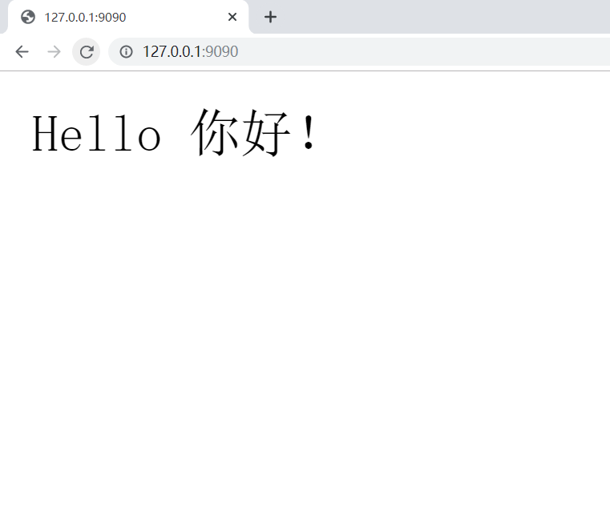

# 第08节:Go语言标准库之net或http

上一节讲述了Go语言标准库中的template,`html/template`包实现了数据驱动模板，用于生成可防止代码注入的安全的HTML内容，这节我们将给大家讲述Go语言内置的`net/http`包十分优秀，提供了HTTP客户端和服务端的实现。

### 一、net/http介绍

##### Go语言内置的`net/http`包提供了HTTP客户端和服务端的实现

### 二、HTTP协议

超文本传输协议(HTTP HyperText Tranfer Protocol)是互联网上应用最广泛的一种网络传输协议，所有WWW文件都必须准守这个标准，设计HTTP最初的目的是为了提供一种发布和接收HTML页面的方法。

### 三、HTTP客户端

##### 基本的HTTP/HTTPS请求

Get、Head/Post和PostForm函数发出HTTP/hTTPS请求。

```go
resp, err := http.Get("http://example.com/")
...
resp, err := http.Post("http://example.com/upload", "image/jpeg", &buf)
...
resp, err := http.PostForm("http://example.com/form",
	url.Values{"key": {"Value"}, "id": {"123"}})
```

程序在使用完response后必须关闭回复的主体

```go
resp, err := http.Get("http://example.com/")
if err != nil {
	// handle error
}
defer resp.Body.Close()
body, err := ioutil.ReadAll(resp.Body)
// ...
```

##### Get请求

使用`net/http`包编写一个简单简单发送HTTP请求的Cient端，代码如下:

```go
package main

import (
	"fmt"
	"io/ioutil"
	"net/http"
)

func main() {
	resp, err := http.Get("https://www.liwenzhou.com/")
	if err != nil {
		fmt.Println("get failed, err:", err)
		return
	}
	defer resp.Body.Close()
	body, err := ioutil.ReadAll(resp.Body)
	if err != nil {
		fmt.Println("read from resp.Body failed,err:", err)
		return
	}
	fmt.Print(string(body))
}
```

将上面代码保存之后编译成可执行文件，执行之后就能在终端打印`liwenzhou.com`网站首页的内容了，我们的浏览器其实就是一个发送和接收HTTP协议数据的客户端，我们平时通过浏览器访问网页其实就是从网站的服务器接收HTTP数据，然后浏览器会按照HTML、CSS等规则将网页渲染展示出来。

##### 带参数的GET请求示例

关于Get请求的参数我们需要使用Go语言内置的`net/url`这个标准库来处理。

```go
func main() {
	apiUrl := "http://127.0.0.1:9090/get"
	// URL param
	data := url.Values{}
	data.Set("name", "小王子")
	data.Set("age", "18")
	u, err := url.ParseRequestURI(apiUrl)
	if err != nil {
		fmt.Printf("parse url requestUrl failed,err:%v\n", err)
	}
	u.RawQuery = data.Encode() // URL encode
	fmt.Println(u.String())
	resp, err := http.Get(u.String())
	if err != nil {
		fmt.Println("post failed, err:%v\n", err)
		return
	}
	defer resp.Body.Close()
	b, err := ioutil.ReadAll(resp.Body)
	if err != nil {
		fmt.Println("get resp failed,err:%v\n", err)
		return
	}
	fmt.Println(string(b))
}
```

对应这个Server端HandlerFunc如下:

```go
func getHandler(w http.ResponseWriter, r *http.Request) {
	defer r.Body.Close()
	data := r.URL.Query()
	fmt.Println(data.Get("name"))
	fmt.Println(data.Get("age"))
	answer := `{"status": "ok"}`
	w.Write([]byte(answer))
}
```

##### Post请求示例

上面演示了使用`net/http`包发送`Get`请求的示例，发送`Post`请示的示例代码如下:

```go
package main

import (
	"fmt"
	"io/ioutil"
	"net/http"
	"strings"
)

// net/http post demo

func main() {
	url := "http://127.0.0.1:9090/post"
	// 表单数据
	//contentType := "application/x-www-form-urlencoded"
	//data := "name=小王子&age=18"
	// json
	contentType := "application/json"
	data := `{"name":"小王子","age":18}`
	resp, err := http.Post(url, contentType, strings.NewReader(data))
	if err != nil {
		fmt.Println("post failed, err:%v\n", err)
		return
	}
	defer resp.Body.Close()
	b, err := ioutil.ReadAll(resp.Body)
	if err != nil {
		fmt.Println("get resp failed,err:%v\n", err)
		return
	}
	fmt.Println(string(b))
}
```

对应的Server端HandlerFunc如下:

```go
package main

import (
	"fmt"
	"io/ioutil"
	"net/http"
	"strings"
)

// net/http post demo

func main() {
	url := "http://127.0.0.1:9090/post"
	// 表单数据
	//contentType := "application/x-www-form-urlencoded"
	//data := "name=小王子&age=18"
	// json
	contentType := "application/json"
	data := `{"name":"小王子","age":18}`
	resp, err := http.Post(url, contentType, strings.NewReader(data))
	if err != nil {
		fmt.Println("post failed, err:%v\n", err)
		return
	}
	defer resp.Body.Close()
	b, err := ioutil.ReadAll(resp.Body)
	if err != nil {
		fmt.Println("get resp failed,err:%v\n", err)
		return
	}
	fmt.Println(string(b))
}
```

##### 自定义Client

要管理HTTP客户端的头域、重定向策略和其他设置，创建一个Client：

```go
client := &http.Client{
	CheckRedirect: redirectPolicyFunc,
}
resp, err := client.Get("http://example.com")
// ...
req, err := http.NewRequest("GET", "http://example.com", nil)
// ...
req.Header.Add("If-None-Match", `W/"wyzzy"`)
resp, err := client.Do(req)
// ...
```

##### 自定义Transport


要管理代理、TLS配置、keep-alive、压缩其他设置，创建一个Transport：

```go
tr := &http.Transport{
	TLSClientConfig:    &tls.Config{RootCAs: pool},
	DisableCompression: true,
}
client := &http.Client{Transport: tr}
resp, err := client.Get("https://example.com")
```

Client和Transport类型都可以安全的被多个goroutine同时使用。出于效率考虑，应该一次建立、尽量重用。


### 四、服务端

##### 默认的Server

Client和Transport类型都可以安全的被多个goroutine同时使用。出于效率考虑，应该一次建立、尽量重用。
Handle和HandleFunc函数可以向DefaultServeMux添加处理器。

```go
http.Handle("/foo", fooHandler)
http.HandleFunc("/bar", func(w http.ResponseWriter, r *http.Request) {
	fmt.Fprintf(w, "Hello, %q", html.EscapeString(r.URL.Path))
})
log.Fatal(http.ListenAndServe(":8080", nil))
```

##### 默认的Server示例

使用Go语言中的`net/http`来编写一个简单的接收HTTP请求的Server端示例，`net/http`包是对net包进行进一步封装，专门用来处理HTTP协议的数据，具体代码如下：

```go
// http server

func sayHello(w http.ResponseWriter, r *http.Request) {
	fmt.Fprintln(w, "Hello 你好！")
}

func main() {
	http.HandleFunc("/", sayHello)
	err := http.ListenAndServe(":9090", nil)
	if err != nil {
		fmt.Printf("http server failed, err:%v\n", err)
		return
	}
}
```

将上面的代码编译之后执行，打开你电脑上的浏览器在地址栏输入`127.0.0.1:9090`回车，此时就能够看到如下页面了。



##### 自定义Server

要管理服务端行为，可以创建一个自定义的Server:

```go
s := &http.Server{
	Addr:           ":8080",
	Handler:        myHandler,
	ReadTimeout:    10 * time.Second,
	WriteTimeout:   10 * time.Second,
	MaxHeaderBytes: 1 << 20,
}
log.Fatal(s.ListenAndServe())
```

### 五、总结

Go语言中HTTP协议包括客户端和服务端，请求方式不同请求结果不同;